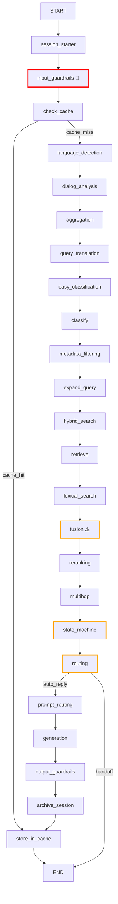

# Архитектурный анализ узлов RAG Pipeline

**Дата анализа:** 2026-01-06
**Версия:** 1.0

## Резюме

После глубокого анализа кодовой базы RAG pipeline я выявил **следующую ситуацию с зависимостями между нодами**:

✅ **ХОРОШИЕ НОВОСТИ:**
- Большинство узлов слабо связаны и могут быть переупорядочены
- Архитектура использует TypedDict State для инкапсуляции данных
- Нет явных импортов между нодами (слабая связанность)
- Большинство нод имеют fallback для отсутствующих полей

⚠️ **КРИТИЧЕСКИЕ ЖЕСТКИЕ ЗАВИСИМОСТИ:**
Существует **5 критических точек упорядочения**, которые НЕ могут быть нарушены по архитектурным или безопасностным причинам.

---

## 1. ЖЕСТКИЕ ЗАВИСИМОСТИ (Hard Dependencies)

### 1.1 Критическое упорядочение (MUST MAINTAIN)

```
session_starter
    ↓
input_guardrails  [SECURITY: Блокировка малиций ПЕРЕД кешем]
    ↓
check_cache       [SECURITY: Только безопасный контент кешируется]
```

**Причина:** Безопасность. Если кеш будет проверен ДО guardrails, малиций контент может пройти через кеш.

**Файлы:** `/app/pipeline/graph.py:160-182` (явное указание)

---

### 1.2 Поисковые узлы (Search Pipelines)

#### Вариант А: Гибридный поиск (Hybrid Search)
```
easy_classification
    ↓
metadata_filtering [USES: semantic_category, semantic_category_confidence]
    ↓
expand_query
    ↓
hybrid_search [USES: translated_query, matched_category, detected_language]
    ↓
reranking     [USES: docs]
```

**Зависимости:**
- `hybrid_search` читает `translated_query` (из `query_translation`)
- `hybrid_search` читает `matched_category` (из `metadata_filtering`)
- `hybrid_search` читает `detected_language` (из `language_detection`)
- `reranking` требует непустого `docs`

#### Вариант B: Разделенный поиск (Vector + Lexical + Fusion)
```
retrieve [USES: aggregated_query or question]
    ↓
lexical_search [USES: question]
    ↓
fusion [USES: vector_results AND lexical_results]
```

**Зависимости:**
- `fusion` ТРЕБУЕТ обоих: `vector_results` и `lexical_results`
- Не может работать, если запущена только одна из функций поиска

---

### 1.3 Multi-hop Reasoning

```
reranking
    ↓
multihop [USES: docs, rerank_scores, confidence, best_doc_metadata]
```

**Зависимости:**
- `multihop` читает поля из `reranking`
- Может выполниться и без них (используя fallbacks)

---

### 1.4 Dialog Analysis → State Machine → Routing

```
dialog_analysis [USES: conversation_history, question]
    ↓  [Fast escalate path для safety violations]
state_machine [USES: dialog_analysis, docs, confidence, guardrails_blocked]
    ↓
routing [USES: action_recommendation from state_machine]
    ↓
[generation or END]
```

**Жесткие требования:**
- `state_machine` должен работать после получения `docs` для полной информации
- `routing` зависит от `action_recommendation` из `state_machine`

**Файл:** `/app/pipeline/graph.py:246-258` (fast escalate logic)

---

### 1.5 Generation Pipeline

```
prompt_routing [USES: system_prompt selection]
    ↓
generation [USES: docs, question, system_prompt]
```

---

## 2. МЯГКИЕ ЗАВИСИМОСТИ (Soft/Conditional Dependencies)

Эти узлы могут быть переупорядочены **при соблюдении контрактов входа/выхода**:

### 2.1 Классификация и обработка языка

| Узел | Использует | Может работать без |
|------|-----------|-------------------|
| `language_detection` | `question` | Да (fallback: 'ru') |
| `easy_classification` | `translated_query \| aggregated_query \| question` | Да (fallback: 'unknown') |
| `classify` | `question` | Да (optional node) |
| `aggregation` | `question, conversation_history` | Да (использует question как-есть) |
| `query_translation` | `detected_language, question` | Да (no-op если same language) |
| `expand_query` | `question` | Да (returns empty if not needed) |

**Возможная переупорядочение:**
- `language_detection` может работать в любой момент (требует только `question`)
- `easy_classification` может быть ДО или ПОСЛЕ `aggregation` (но должен быть ДО `metadata_filtering`)
- `query_translation` может быть ДО классификации

---

### 2.2 Узлы с полными fallbacks

Эти узлы **полностью независимы** и могут быть удалены/переупорядочены:

- `output_guardrails` - обрабатывает готовый ответ (конец pipeline)
- `archive_session` - сохраняет в БД (конец pipeline)
- `store_in_cache` - кеширует результат (конец pipeline)

---

## 3. АНАЛИЗ КОНТРАКТОВ (State Contracts)

### 3.1 Таблица входов/выходов

| Узел | Входы (Required) | Входы (Optional) | Выходы |
|------|------------------|------------------|--------|
| `session_starter` | `user_id, session_id` | — | `conversation_history, user_profile, attempt_count` |
| `input_guardrails` | `question` | — | `guardrails_blocked, guardrails_passed, guardrails_risk_score` |
| `check_cache` | `question` | — | `cache_hit, cache_key, answer` |
| `language_detection` | `question` | — | `detected_language, language_confidence` |
| `dialog_analysis` | `question, conversation_history` | — | `dialog_analysis (dict)` |
| `aggregation` | `question` | `conversation_history` | `aggregated_query, extracted_entities` |
| `query_translation` | `question` | `detected_language` | `translated_query, translation_performed` |
| `easy_classification` | `question` | — | `semantic_intent, semantic_category, semantic_category_confidence` |
| `metadata_filtering` | `semantic_category` | `semantic_category_confidence` | `filter_used, matched_category` |
| `expand_query` | `question` | — | `queries: List[str]` |
| `hybrid_search` | `translated_query \| aggregated_query \| question` | `matched_category, detected_language` | `docs, scores, confidence, vector_results` |
| `retrieve` | `aggregated_query \| question` | `matched_category` | `docs, scores, confidence, vector_results` |
| `lexical_search` | `question` | — | `docs, scores, lexical_results` |
| `fusion` | `vector_results, lexical_results` | — | `docs, scores, confidence` |
| `reranking` | `question, docs` | — | `docs, rerank_scores, confidence` |
| `multihop` | `question, docs` | `rerank_scores, confidence` | `docs, merged_context, hops_performed` |
| `state_machine` | `dialog_analysis` | `docs, confidence, guardrails_blocked` | `dialog_state, action_recommendation, escalation_reason` |
| `routing` | `action_recommendation` | `escalation_message` | `action` (auto_reply \| handoff) |
| `prompt_routing` | — | `state` | `system_prompt, generation_strategy` |
| `generation` | `question, docs` | `system_prompt` | `answer` |
| `output_guardrails` | `answer` | — | `answer` (filtered) |
| `archive_session` | `answer, dialog_state` | — | — |
| `store_in_cache` | — | `answer` | — |

### 3.2 Проблемные области (Risk Points)

**ЖЕЛТЫЙ ФЛАГ 🟡:** Узлы с жесткой зависимостью на наличие поля:

1. **`fusion`** - ТРЕБУЕТ обоих `vector_results` И `lexical_results`
   - Файл: `/app/nodes/fusion/node.py:11-12`
   - Проблема: Если запущена только одна поиска (retrieve/lexical_search), fusion вернет пустые результаты
   - Решение: Используйте ИЛИ `hybrid_search`, ИЛИ обе функции (retrieve + lexical_search)

2. **`metadata_filtering`** - требует `semantic_category` (выход из `easy_classification`)
   - Файл: `/app/nodes/metadata_filtering/node.py:16`
   - Может работать без: Возвращает `filter_used=False`
   - Безопасно: Да

3. **`reranking`** - требует непустого `docs`
   - Файл: `/app/nodes/reranking/node.py:14-15`
   - Может работать без: Возвращает пустой список
   - Безопасно: Да

---

## 4. ТЕКУЩАЯ АРХИТЕКТУРА (pipeline_order.yaml)

```
session_starter          # 1. Загрузка истории сессии
input_guardrails         # 2. Проверка безопасности (ДО кеша!)
check_cache              # 3. Кеш (после guardrails)
language_detection       # 4. Определение языка
dialog_analysis          # 5. Анализ диалога
aggregation              # 6. Агрегация запроса
query_translation        # 7. Перевод запроса
easy_classification      # 8. Семантическая классификация
classify                 # 9. Intent/category классификация
metadata_filtering       # 10. Фильтрация по метаданным
expand_query             # 11. Расширение запроса
hybrid_search            # 12. Гибридный поиск
retrieve                 # 13. Векторный поиск (параллельный гибридному?)
lexical_search           # 14. Лексический поиск BM25
fusion                   # 15. Объединение результатов поиска
reranking                # 16. Переранжирование
multihop                 # 17. Multi-hop reasoning
state_machine            # 18. Машина состояния диалога
routing                  # 19. Финальная маршрутизация
prompt_routing           # 20. Выбор промпта
generation               # 21. Генерация ответа
output_guardrails        # 22. Проверка выходного контента
archive_session          # 23. Сохранение сессии
store_in_cache           # 24. Кеширование результата
```

---

## 5. РЕКОМЕНДАЦИИ ПО ПЕРЕУПОРЯДОЧЕНИЮ

### 5.1 Какие узлы НЕЛЬЗЯ менять

🚫 **ЗАПРЕЩЕНО менять порядок:**

1. ~~`session_starter` → `input_guardrails` → `check_cache`~~
   - Причина: Безопасность
   - Можно ослабить: Нет

2. ~~`hybrid_search/retrieve` → `fusion` (если используется fusion)~~
   - Причина: `fusion` нужны результаты обеих функций поиска
   - Решение: Использовать ИЛИ `hybrid_search` ИЛИ обе функции

3. ~~`reranking` → `multihop` → `state_machine`~~
   - Причина: `state_machine` нужна финальная `confidence` от reranking
   - Можно ослабить: Да, если убрать использование `confidence` из state_machine

4. ~~`state_machine` → `routing`~~
   - Причина: `routing` требует `action_recommendation` от state_machine
   - Можно ослабить: Нет (рокировка в logic.py)

5. ~~`routing` → `generation` (или END)~~
   - Причина: `routing` определяет, идти ли в generation
   - Можно ослабить: Нет

### 5.2 Какие узлы МОЖНО переупорядочить

✅ **МОЖНО менять порядок:**

1. **`language_detection`** - может быть в любой момент
   - Зависит: Только от `question`
   - Может быть: Первым, вторым или середине (до `query_translation`)

2. **`easy_classification`** и **`classify`** - можно переместить
   - Зависит: От `question` или `translated_query`
   - Может быть: Раньше или позже `aggregation`
   - Ограничение: ДОЛЖНЫ быть ДО `metadata_filtering`

3. **`expand_query`** - может быть гибче
   - Зависит: От `question`
   - Может быть: ДО или ПОСЛЕ `hybrid_search`
   - Рекомендация: Раньше поиска для эффективности

4. **`output_guardrails`** - может быть до `archive_session`
   - Может быть: Прямо после `generation`

5. **`archive_session`** и **`store_in_cache`** - порядок неважен
   - Могут быть в любом порядке в конце

### 5.3 Потенциальные оптимизации

#### 3.3.1 Параллелизм

Некоторые узлы можно запустить параллельно:

```python
# Возможный параллельный граф:
language_detection ──┐
easy_classification ─┼─→ metadata_filtering
dialog_analysis ─────┘

# Параллельный поиск:
retrieve ──┐
lexical ───┼─→ fusion → reranking
```

#### 3.3.2 Условное выполнение

- `multihop` может быть пропущен если `confidence > high_threshold`
- `expand_query` может быть пропущен если `easy_classification` уверена

---

## 6. ПРОБЛЕМЫ И РИСКИ

### 6.1 Текущие архитектурные проблемы

| Проблема | Серьезность | Описание | Рекомендация |
|----------|------------|---------|-------------|
| `fusion` требует обе функции поиска | 🔴 ВЫСОКАЯ | Если запущена только `retrieve`, без `lexical_search`, fusion вернет пустой результат | Документировать или переделать логику fusion |
| `state_machine` зависит от `confidence` | 🟡 СРЕДНЯЯ | Полагается на `confidence` из reranking, может быть пересчитана раньше | Сделать поле опциональным или пересчитать в state_machine |
| Множественные поиски конкурируют | 🟡 СРЕДНЯЯ | `hybrid_search`, `retrieve`, `lexical_search` все переписывают `docs` | Четко определить приоритет или использовать conditionals |
| `aggregation` может вернуть пустоту | 🟢 НИЗКАЯ | Если conversation_history пуста и aggregation=LLM падает | Имеет fallback |

### 6.2 Несоответствия (Inconsistencies)

| Зона | Проблема |
|------|----------|
| Поле `docs` | Перезаписывается `retrieve` → `hybrid_search` → `lexical_search` → `fusion` → `reranking` → `multihop` |
| Поле `confidence` | Устанавливается разными нодами (retrieve, reranking, multihop) |
| Поле `scores` vs `rerank_scores` | Используются оба названия |
| Поле `matched_category` | Может быть None если filter_used=False |

---

## 7. ГРАФ ЗАВИСИМОСТЕЙ (Mermaid Diagram)



---

## 8. ЗАКЛЮЧЕНИЕ

### Ответ на исходный вопрос

**❓ "Никакая нода не зависит от другой жестко?"**

**❌ НЕТ** - есть 5 критических жестких зависимостей:

1. `session_starter` → `input_guardrails` → `check_cache` (безопасность)
2. Если используется `fusion`, требует обе функции поиска
3. `reranking` → `state_machine` (нужна confidence)
4. `state_machine` → `routing` (action_recommendation)
5. `routing` → `generation/END` (условный переход)

**✅ "Их можно менять согласуя входы/выходы?"**

**ЧАСТИЧНО** - некоторые узлы можно переупорядочить, если соблюдать контракты:

- ✅ Узлы классификации, языка, расширения запроса - гибкие
- ⚠️ Узлы поиска и state management - жестко связаны
- 🚫 Безопасность (guardrails) и маршрутизация - не гибкие

### Рекомендации архитектуры

1. **Оставить текущий порядок** в `pipeline_order.yaml` - он оптимален
2. **Документировать критические зависимости** в комментариях
3. **Дополнить fallbacks** в узлах с жесткими требованиями
4. **Рассмотреть параллелизм** для классификации и анализа диалога
5. **Четко определить приоритет** при конкурирующих поисках

---

## Файлы для справки

- 📄 `/app/pipeline/graph.py` - архитектура графа
- 📄 `/app/pipeline/state.py` - схема состояния
- 📄 `/app/pipeline/pipeline_order.yaml` - порядок выполнения
- 📁 `/app/nodes/*/node.py` - реализации узлов

