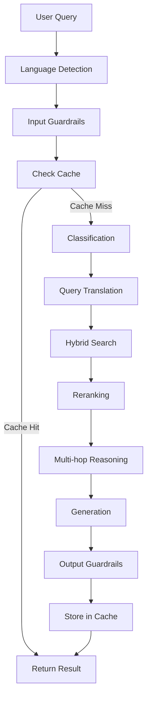

# System Architecture

Support RAG is built on a highly modular, node-based architecture. This design allows for complex retrieval-augmented generation pipelines that are easy to debug, test, and extend.

## 🏗️ High-Level Overview

The system processes user queries through a series of stages, each handled by specialized "Nodes". A node is a single, focused processing unit with a clearly defined Input and Output contract.

### Data Flow Diagram

## 🧩 Pipeline Nodes

The system currently features 28+ specialized nodes, grouped by their function:

### 1. Pre-Processing & Safety
- **Language Detection**: Identifies the language of the user query.
- **Input Guardrails**: Scans for toxicity, PII, and prompt injection.
- **Session Starter**: Initializes or retrieves the conversation session.

### 2. Caching Layer
- **Check Cache**: Performs semantic search in Redis to find similar previous queries.
- **Cache Similarity**: Calculates how relevant a cached response is to the current query.
- **Store in Cache**: Saves successful responses for future reuse.

### 3. Query Understanding
- **Classification**: Categorizes the intent of the user query (e.g., Support, Sales, Technical).
- **Easy Classification**: Fast, rule-based classification for common patterns.
- **Query Translation**: Translates queries into the knowledge base's primary language.
- **Query Expansion**: Generates variations of the query to improve retrieval recall.

### 4. Retrieval & Reasoning
- **Hybrid Search**: Combines Lexical (PostgreSQL) and Vector (Qdrant) search.
- **Reranking**: Re-orders search results using cross-encoders for higher precision.
- **Multi-hop Reasoning**: Decomposes complex queries into multiple sub-steps.
- **Metadata Filtering**: Applies filters based on user context or document properties.

### 5. Generation & Post-Processing
- **Generation**: Uses Large Language Models (LLMs) to synthesize the final answer.
- **Output Guardrails**: Validates the generated response for accuracy and safety.
- **Aggregation**: Combines results from multiple retrieval paths.
- **Fusion**: Merges overlapping sources and scores.

## 💾 Storage Layer

Support RAG uses a multi-tier storage approach:

- **PostgreSQL**: Stores raw documents, metadata, and handles lexical search (BM25).
- **Qdrant**: High-performance vector database for semantic search and embeddings.
- **Redis**: Low-latency cache for sessions, semantic query caching, and rate limiting.

## 🔄 State Management

The pipeline maintains a `State` dictionary that is passed between nodes. Each node reads what it needs and adds its output to the state. We use **Reducers** to handle how different nodes update the same state keys (e.g., merging sources instead of overwriting).

## 📊 Observability

We use **Langfuse** for full-cycle tracing of every request. This allows us to monitor:
- Latency per node.
- Model usage and costs.
- Retrieval quality (precision/recall).
- Generation faithfulness.
